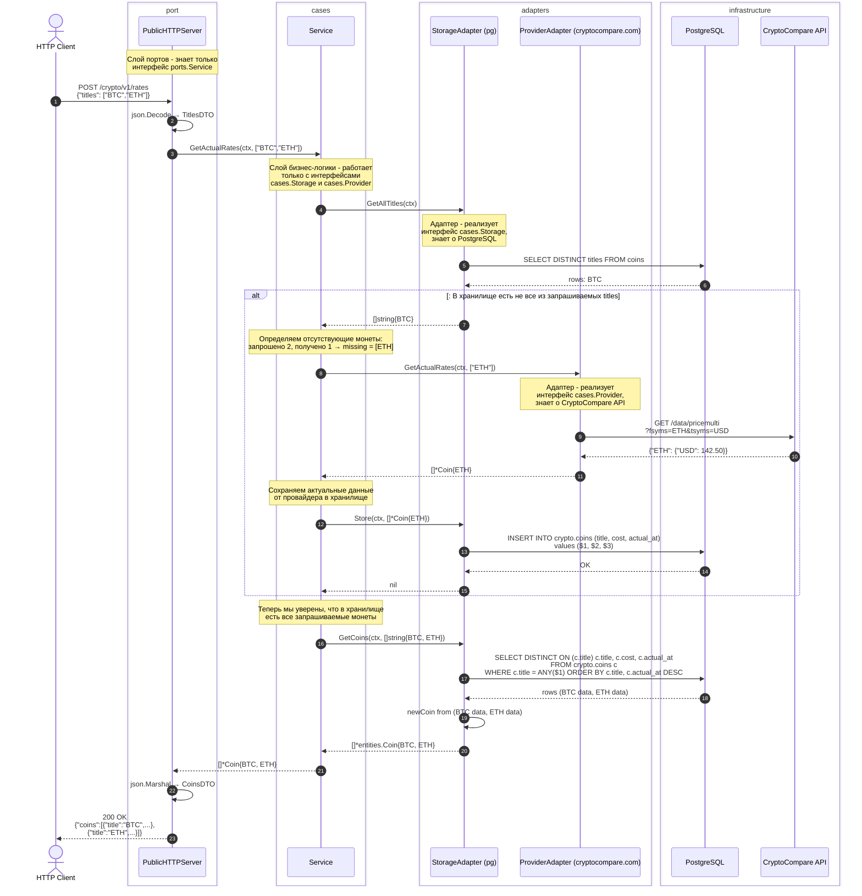

# Курсы криптовалют

## Задача

Необходимо разработать сервис, который будет принимать на вход запросы со списком сокращенных названий
криптовалют, например: BTC, ETH и, возвращать данные по запрашиваемым монетам, в частности: название и их стоимость.
Необходимо, чтобы помимо запросов об актуальной стоимости, можно было передавать запросы в которые бы передавался
параметр - название агрегирующей функции и этот запрос возвращал в зависимости от типа агрегирующей функции:
минимальное, максимальное или среднее значение для выбраной монеты за текущий день.

Сервис должен стоиться с применением методов построения REST API, концепции чистой архитектуры, кодовая база должна
быть покрыта тестами, необходимая инфраструктура должна быть запущена в виде докер контейнеров.
Проект должен итеративно пушится в репозиторий

### Пример запроса и ответа

#### пример запроса

POST /crypto/v1/rates HTTP/1.1
Host: localhost
Content-Type: application/json

```json
{
	"titles": ["BTC", "ETH"]
}
```

#### пример ответа:

```json
{
	"coins": [
		{
			"title": "BTC",
			"cost": 67807.9609375,
			"actual_at": "2026-03-31T00:00:00Z"
		},
		{
			"title": "ETH",
			"cost": 2066.030029296875,
			"actual_at": "2026-03-31T00:00:00Z"
		}
	]
}
```

# Итерация №1. Архитектурная задача.

## Задача встречи

1. Рассказать студентам о диаграмме классов, диаграмме последовательностей;
2. Применить принципы построения чистой архитектуры для решения поставленной задачи;
3. Подробно рассмотреть слои и их назначения, обсудить взаимосвязь, через имплементацию интерфейсов;
4. Рассказать про работу с ошибками, объяснить, что нужно стремиться к минимизации типов ошибок, при этом использовать враппинг, рассказать про [пакет](https://github.com/pkg/errors) errors;
5. Реализация древа каталогов согласно стандартного [проекта](https://github.com/golang-standards/project-layout);

## Результат

1. Студент понимает предназначение слоев проекта.
2. Студент готов реализовать слой entities.
3. Студент понимает, что не нужно создавать уникальные ошибки для каждого случая, нужно использовать универсальные и врапать их.

## Теоретический блок

### Работа с ошибками. Почему это важно.

В Go принято объявлять небольшой набор универсальных ошибок на уровне домена (entities слоя) и использовать их повсюду в проекте, оборачивая контекстом по мере прохождения через слои.

**Почему не нужно создавать отдельную ошибку для каждого случая?**

Представь, что в конструкторе coin ты возвращаешь

```go
errors.New("title is empty string")
```

или

```go
errors.New("cost must be greater than 0")
```

Вызывающий код вынужден будет сравнивать строки, чтобы понять что произошло - это хрупко и сломается при любом рефакторинге сообщения.

Вместо этого объявляется один sentinel (**Sentinel-ошибка** - это заранее объявленная переменная-ошибка с фиксированным значением, которая служит эталоном для сравнения. Её не создают в момент возникновения ошибки, а объявляют один раз на уровне пакета и затем только оборачивают контекстом.):

```go
var ErrInvalidParam = errors.New("invalid param")
```

И дальше по всему коду только он - с добавлением контекста через враппинг.

**Как оборачивать?**

```go
	errors.Wrap(ErrInvalidParam, "title not set")
	...
	errors.Wrap(ErrInvalidParam, "cost must be greater then 0.0")
	...
	errors.Wrap(ErrInvalidParam, "time not set") // ошибка уже содержит ErrInvalidParam внутри
```

`errors.Wrap` добавляет сообщение и сохраняет оригинальную ошибку в цепочке.
Итоговое сообщение будет читаться как `"time not set: invalid param"` - сразу виден путь.

**Как проверить?**

```go
if errors.Is(err, entities.ErrInvalidParam) {
    // вернуть 400
}
if errors.Is(err, entities.ErrNotFound) {
    // вернуть 404
}
```

`errors.Is` проходит всю цепочку враппинга и находит оригинальный sentinel - неважно, сколько слоёв контекста добавлено сверху.

### Небольшая справка по написанию тестов

**Как назвать пакет с тестами**
Пакет для тестов должен называться `entities_test`, а не `entities`!

Пакет `entities_test` - это отдельный внешний пакет. Тест видит только то, что экспортировано из `entities` - конструкторы, методы, ошибки. Это гарантирует, что ты тестируешь публичный контракт, а не внутренние детали реализации. Именно таким этот пакет видит его импортер(слой cases, adapter и др.)

Если назвать пакет `entities` - тест получит доступ к приватным полям, и граница между логикой и тестом размоется.

**Почему используем библиотеку testify?**
Стандартная библиотека Go предоставляет только `t.Error` и `t.Fatal` - с ними тесты многословны и неинформативны при падении. Вместо этого используется `testify`, методы стандартной библиотеки затруднительны в части сравнения ожидаемого и фактического результатов, тогда как в `testify` есть огромное количество возможностей для сравнения.

**Почему табличные тесты**

```go
func TestNewCoin(t *testing.T) {
	t.Parallel()

	var nilTime time.Time
	type args struct {
		title string
		cost  float64
		opts  []entities.CoinOption
	}
	tests := []struct {
		name    string
		args    args
		want    *entities.Coin
		wantErr bool
		resErr  error
	}{
		{
			name: "invalid title",
			args: args{
				title: "",
				cost:  1.1,
				opts:  nil,
			},
			wantErr: true,
			resErr:  entities.ErrInvalidParam,
		},
		...
		{
			name: "success",
			args: args{
				title: "BTC",
				cost:  1.1,
				opts:  []entities.CoinOption{entities.WithConcreteActualAt(getConcreteTime(t))},
			},
		},
	}
	for _, tc := range tests {
		tc := tc
		t.Run(tc.name, func(it *testing.T) {
			it.Parallel()

			coin, err := entities.NewCoin(tc.args.title, tc.args.cost, tc.args.opts...)
			if tc.wantErr {
				require.Nil(it, coin)
				require.ErrorIs(it, err, tc.resErr)
				return
			}
			require.NotNil(it, coin)
			require.NoError(it, err)

			require.Equal(it, tc.args.title, coin.Title())
			require.InDelta(it, tc.args.cost, coin.Cost(), 0.1)
			require.Equal(it, getConcreteTime(it), coin.ActualAt())
		})
	}
}
```

такие тесты позволяют не дублировать на множество тестов общую логику, например в данном случае создание монеты с указанными параметрами для всех тестов было бы общим, и оно логично обобщено, то же самое касается сценариев проверки результатов, нет смысла много раз делать одно и то же, если можно организовать это в рамках одного табличного теста.
Это не значит, что нужно использовать только табличные тесты, если логика тестов радикально отличается, то проще написать несколько отдельных тестов.

**Важно** понимать, что лучше писать отдельные юнит тесты для проверки, если трудно даются табличные, чем вообще не писать.

Тесты - гарантия качества продукта, все начинается с малого!

**Важно** не подгонять тесты под код, тесты должны проверять соответствие результатов - ожиданиям исходя из требований, а не из конкретной реализации той или иной тестируемой функции.

## Задание на следующую итерацию

1. Новый репозиторий (желательно github);
2. Формирование примерной структуры проекта, опираясь на go standart layout;
3. Готовый `entities` слой (помним про инкапсуляцию);
4. Конструктор сущности `Coin` (помним про валидацию параметров);
5. Ошибки конструктора создаются с враппингом;
6. Тесты для `entities` слоя (пакет testify) покрыть `entities` на 100%.

## Контрольные вопросы

- Если ты делаешь для каждого этапа валидации новую ошибку, то к чему это может привести? Как решить эту проблему?
- Что будет, если оставить поля в структуре Coin - экспортируемыми?
- Какие есть варианты решения проблемы?
- Как сделать так, чтобы содержимое полей структуры Coin можно было посмотреть, но нельзя было изменить?
- Почему лучше разделять пакеты для тестирования и с логикой, например: entities для Coin и entities_test для тестов конструктора и метода монет?
- Чем отличается require от assert в testify и чем лучше пользоваться в нашем случае, почему?
- Как сделать так, чтобы тесты могли запускаться параллельно?
- Чем лучше табличное тестирование, чем индивидуальный тест для каждого кейса?

## Примерная диаграмма классов

```mermaid
classDiagram
    Storage .. Coin: use
    Provider .. Coin: use
    Service *-- Storage
    Service *-- Provider
    PostgresStorage ..|> Storage
    CryptoCompareProvider ..|> Provider
    Service ..|> UseCaseProvider
    Public *--UseCaseProvider


    namespace entities {
        class Coin{
        -title string
        -cost float64
        -actualAt time.Time

        +Title() string
        +Cost() float64
        +ActualAt() time.Time
        }
    }

    namespace cases{
        class Storage {
            <<interface>>
            +GetAllTitles(ctx context.Context)([]string, error)
            +Store(ctx context.Context, coins []*entities.Coin) error
            +GetCoins(ctx context.Context, titles []string) ([]*entities.Coin, error)
            +GetAggregatedCoins(ctx context.Context, titles []string, aggType string) ([]*entities.Coin, error)
        }

        class Provider {
            <<interface>>
            +GetActualRates(ctx context.Context, titles []string) ([]*entities.Coin, error)
        }

        class Service {
            -provider Provider
            -storage Storage

            +GetActualRates(ctx context.Context, titles []string) ([]*entities.Coin, error)
            +GetAggregateRates(ctx context.Context, titles []string, aggType string) ([]*entities.Coin, error)
            +ActualizeRates(ctx context.Context) error

            -processUnstoredTitles(ctx context.Context, titles []string) error
        }
    }

    namespace adapters{
        class PostgresStorage{
            -db *pgxpool.Pool

            +GetAllTitles(ctx context.Context)([]string, error)
            +Store(ctx context.Context, coins []*entities.Coin) error
            +GetCoins(ctx context.Context, titles []string) ([]*entities.Coin, error)
            +GetAggregatedCoins(ctx context.Context, titles []string, aggType string) ([]*entities.Coin, error)
            -processRows(ctx context.Context, query string, params []any) ([]*entities.Coin, error)
        }

        class CryptoCompareProvider {
            -client *http.Client

            +GetActualRates(ctx context.Context, titles []string) ([]*entities.Coin, error)
        }
    }

    namespace port{
        class UseCaseProvider{
            <<interface>>
            +GetActualRates(ctx context.Context, titles []string) ([]*entities.Coin, error)
            +GetAggregateRates(ctx context.Context, titles []string, aggType string) ([]*entities.Coin, error)
            +ActualizeRates(ctx context.Context) error

        }

        class Public{
            router *http.Server

            -actualRates(resp http.ResponseWriter, req *http.Request)
            -aggregatedRates(resp http.ResponseWriter, req *http.Request)
        }
    }

```



# Итерация №2. Entities, Cases layers

## Задача встречи

1. Проверка структуры каталогов
2. Проверка `entities` слоя
3. Создание сущности `service`;
4. Демонстрация принципов инверсии зависимостей на примере `provider` и `storage`
5. Создание конструктора (валидация объектов интерфейсов)
6. Обстоятельно обсудить назначение интерфейсов, добиться понимания
7. Устно проговорить реализацию методов.

## Результат

1. Доработан при необходимости и согласован слой `entities`;
2. Студент умеет замерять процент покрытия тестами нужные участки кода;
3. Слой `entities` покрыт тестами на 100%;
4. Реализованы интерфейсы для `cases` слоя;
5. Студент понимает принципы инверсии, понимает, что не нужно внедрять сейчас конкретную реализацию, достаточно обогащать интерфейс необходимыми методами;
6. Студент понимает валидацию параметров интерфейсов в конструкторе `service`.
7. Студент понимает, что `service` это не реализация какого-нибудь интерфейса, а самостоятельная реализация, которая включает в себя объекты, удовлетворяющие заданным интерфейсам.

## Теоретический блок

### Инверсия зависимостей в деле

`Service` не знает ничего о PostgreSQL или CryptoCompare/CoinGecko. Он работает только с интерфейсами, объявленными в `cases` слое:

```go
type Storage interface {
    GetAllTitles(ctx context.Context) ([]string, error)
    Store(ctx context.Context, coins []*entities.Coin) error
    GetCoins(ctx context.Context, titles []string) ([]*entities.Coin, error)
    GetAggregatedCoins(ctx context.Context, titles []string, aggType string) ([]*entities.Coin, error)
}

type Provider interface {
    GetActualRates(ctx context.Context, titles []string) ([]*entities.Coin, error)
}
```

Конструктор принимает именно интерфейсы, а не конкретные реализации:

```go
func NewService(provider Provider, storage Storage) (*Service, error) { ... }
```

Это даёт главное преимущество: если завтра CoinGecko заблокирует ключ, или компания решит перейти с PostgreSQL на другую БД - бизнес-логика в `Service` не изменится вообще. Пишется новый адаптер, реализующий тот же интерфейс, и подключается вместо старого. В Go интерфейс реализуется неявно - никакого `implements`. Достаточно чтобы тип имел все нужные методы.

### Проверка на nil

Интерфейс в Go состоит из двух полей: указатель на тип и указатель на значение. Нулевое значение интерфейса - когда оба поля равны `nil`.

Если не проверить параметры конструктора на `nil` - при первом же вызове метода произойдёт паника в рантайме. Это труднее отлаживать, чем ошибку при инициализации:

```go
func NewService(provider Provider, storage Storage) (*Service, error) {
    if provider == nil {
        return nil, errors.Wrap(entities.ErrInvalidParam, "provider not set")
    }
    if storage == nil {
        return nil, errors.Wrap(entities.ErrInvalidParam, "storage not set")
    }
    ...
}
```

Падение с понятным сообщением при старте - всегда лучше, чем паника в продакшне в момент обработки запроса.

### Декомпозиция задачи

Перед реализацией метода полезно разобрать задачу от общего к частному.

Нужно вернуть актуальные курсы для запрошенных монет. Как?

```
Получить запрошенные монеты
└── Все ли они есть в хранилище?
    ├── Да → забрать из хранилища и вернуть
    └── Нет → каких не хватает?
        └── Запросить недостающие у провайдера
            └── Сохранить в хранилище
                └── Забрать все запрошенные из хранилища и вернуть
```

Постарайся понять как применять предлагаемые методы интерфейсов, в каких-то ситуациях их будет достаточно, но, например, чтобы понять, каких монет не хватает, нужно выйти за рамки методов интерфейсов и реализовать алгоритм, позволяющий находить пересечение множеств, как это реализовать? Подумай, сначала смоделируй ситуацию на чем-нибудь понятном, чтобы лучше предствить механику и уже потом, отобрази это в коде, важно понять, тогда все будет очень просто.

### Генерация моков и их использование в тестах

Чтобы работать с моками, необходимо установить инструмент для их генерации, например:

```sh
go install github.com/golang/mock/mockgen@v1.6.0
```

чтобы не забывать обновлять моки, при изменении или доработке интерфейса, проще всего использовать аннотации

```go
//go:generate mockgen -source=storage.go -destination=./testdata/storage.go -package=testdata
type Storage interface { ... }
```

такая аннотация позволит сгенерировать мок из конкретного источника(файла), сгенерированный файл положить в конкретное место и назвать пакет, как вам нужно, это, обычно: mocks или testdata

чтобы сгенерировать моки можно использовать либо встроенные в ide механизмы (как в тестах - кнопку запуска) или команду в терминале:

```sh
go generate ./...
```

В тесте мок настраивается через `EXPECT()` - указываешь какой метод будет вызван, с какими аргументами и что вернёт:

```go
ctrl := gomock.NewController(t)

storage := testdata.NewMockStorage(ctrl)
storage.EXPECT().
    GetAllTitles(ctx).
    Return([]string{"BTC"}, nil)

service, _ := cases.NewService(provider, storage)
```

Мок реализует интерфейс `cases.Storage`, но не ходит в базу - возвращает то, что ты задал. Это позволяет тестировать логику `Service` изолированно, без инфраструктуры.

### Процент покрытия кода тестами

Важно понимать, что бизнес-логика предствляет из себя наиболее важную часть проекта, она должна быть покрыта тестами на 100% чтобы понимать, какие сценарии тестами были покрыты, а какие только предстоит покрыть, можно пользоваться командой

```sh
go test -cover ./...
```

так же в vs code или goland есть возможномть визуализации: красным подсвечивается то, что не покрыто тестами, зеленым - покрытое.

## Задание на следующую итерацию

1. Реализация `cases` слоя
2. Четкое понимание реализации методов, задействующих `storage` и `provider`
3. Внедрение `gomock`, генерация моков c помощью аннотаций
4. Покрытие кода `cases` слоя тестами

## Контрольные вопросы

- Почему необходимо валидировать объекты интерфейсов?
- Может ли entities слой знать что-нибудь о слое cases?
- Может ли слой cases знать что-нибудь об entities?
- Для чего нужны моки? Почему нельзя обойтись без них?
- В каком виде мы передаем информацию, например, возвращаем слайсы с монетами, в виде копий или в виде указателей? Как обосновывается выбор?

## Примерная диаграмма последовательностей выполнения запроса

на диаграмме представлен полный Flow при запросе от клиента, затрагивающий все слои приложения, можно использовать его в качестве основы написания бизнес-логики и адаптеров, но важно помнить, что реализация в любом случае всегда может быть и должна быть оптимизирована.



# Итерация №3. Adapters - Provider

## Задача встречи

1. Проверка `cases` слоя
2. Проверка тестов, бизнесс-логика должна быть покрыта на 100% (студент понимает, как работают моки, в идеале, если есть табличные тесты)
3. Реализация клиента на базе` cryptocompare.com API` или другого сервиса.
4. Посмотреть базовые примеры запросов
5. Рассказать про `url` и `query`-параметры. Про то, как они задаются в Go при помощи пакета `url`, про то, что недопустимо вставлять параметры с использованием обычной конкатенации или форматирования
6. Объяснить, что такое `POC` как его можно создать для проверки реализации клиента.
7. Показать паттерн options и как его можно применить при реализации адаптера клиента для конкретного провайдера.

## Результат

1. `сases` слой приведен в порядок;
2. Есть понимание работы с моками, их настройкой
3. Рассмотрен пример работы со сторонним клиентом
4. Есть понимание того, как нужно устанавливать `query` параметры в запросе

## Теоретический блок

### Проверка объекта на предмет имплементации интерфейса

Если тип не реализует интерфейс полностью - Go сообщит об этом только в момент передачи объекта туда, где интерфейс ожидается. Это может быть далеко от места ошибки, как правило, в слое applications. Однако, есть способ осуществлять проверку на предмет соответствия объекта интерфейсу, например, для провайдера, это может выглядеть так:

```go
var _ cases.Provider = (*BaseClient)(nil)
```

где `*BaseClient` - это структура, имплементирующая интерфейс `cases.Provider` и, если `cases.Provider` не имплементирует интерфейс, то данная проверка будет возвращать ошибку компиляции немедленно. Эта проверка очень полезна, не принебрегайте ею, если интерфейс поменяется, вы сразу об этом узнаете.

### Что такое паттерн options?

Предположим, что вы хотите создать систему, адаптированную под работу с разными категориями пользователей, скажем, часть аудитории - хотят видеть отображение цен криптовалюты в USD, а другая часть в EUR, другая часть в RUR. Таким образом напрашивается необходимоть передавать конкретную валюту в которой будет выражена цена, но это создает неудобства для абсолютного большенства пользователей, которые хотят видеть цену в USD, получается, что было бы здорово уметь задавать какое-то поведение или параметр в виде дефолтного значения, но иметь возможность его модифицировать, в каких-то частных случаях, желательно, не переделывая глобально уже текущую реализацию, не меняя тесты, и документацию. В таком случае, на помощь приходит паттерн options

```go
type ClientOption func(*BaseClient)

func WithCustomCostIn(costIn string) ClientOption {
    return func(c *BaseClient) {
        c.costIn = costIn
    }
}

func NewBaseClient(ratesSource RatesSource, opts ...ClientOption) (*BaseClient, error) {
    client := &BaseClient{...}
    for _, opt := range opts {
        opt(client)
    }
    return client, nil
}
```

Без паттерна: каждый новый параметр - новый аргумент конструктора, который ломает всех вызывающих. С паттерном: новые параметры добавляются через новые опции, старый код не меняется.

### Как собирать URL?

Никогда не собирать URL конкатенацией или `fmt.Sprintf` - спецсимволы в значениях сломают запрос, а пользовательские данные могут изменить структуру URL.

Правильный способ через `net/url`:

```go
url, err := url.Parse("https://api.coingecko.com/api/v3/simple/price")
if err != nil {
    return nil, err
}

query := url.Query()
query.Set("symbols", strings.Join(titles, ","))
query.Set("vs_currencies", costIn)
query.Set("x_cg_demo_api_key", c.token)
url.RawQuery = query.Encode()
```

`query.Encode()` автоматически экранирует все спецсимволы. Итоговый URL будет корректным при любых входных данных.

### Для чего нужен контекст при отправке запроса?

`http.NewRequestWithContext` вместо `http.NewRequest` позволяет отменить запрос извне:

```go
req, err := http.NewRequestWithContext(ctx, http.MethodGet, url.String(), nil)
```

Если клиент отключился, сработал таймаут выше по стеку или пришёл сигнал остановки - контекст отменяется и запрос прерывается немедленно. Без контекста запрос будет висеть до своего завершения независимо от того, нужен ли ещё результат.

### Почему нужно закрывать тело ответа?

```go
resp, err := bc.Do(req)
if err != nil {
    return nil, err
}
defer resp.Body.Close()
```
`resp.Body` - это открытое сетевое соединение. Если его не закрыть, соединение не вернётся в пул и будет занято до сборки мусора. При достаточной нагрузке соединения закончатся и новые запросы начнут падать.
`defer` гарантирует закрытие даже если при чтении тела произошла ошибка.

### Что такое POC?
**POC (Proof of Concept)** - это быстрая проверка что идея работает, до написания полноценного кода.

При реализации адаптера провайдера: прежде чем встраивать клиент в архитектуру, создай временный файл и убедись что API отвечает так, как ожидается:
```go
// tmp/main.go - удаляется после проверки
func main() {
    resp, err := http.Get("https://api.coingecko.com/api/v3/simple/price?symbols=BTC&vs_currencies=usd&x_cg_demo_api_key=YOUR_KEY")
    if err != nil {
        log.Fatal(err)
    }
    defer resp.Body.Close()
    
    body, _ := io.ReadAll(resp.Body)
    fmt.Println(string(body))
}
```
Запустил, увидел ответ, понял структуру - теперь можно писать парсер и встраивать в адаптер. Это экономит время: лучше убедиться в работе API за 5 минут, чем отлаживать полноценный адаптер.

## Задачи

1. Реализация адаптера клиента с проверкой на поке (`POC - proof of concept`). Клиент должен имплементировать интерфейс провайдера.
2. Устранение выявленных проблем
3. Для автоматизации процесса запуска docker-compose и, в дальнейшем других систем, нужно установить утилиты для автоматизации: или `taskfile` или `makefile` разобрались с тем, как создавать задачи, добавили запуск тестов по команде.
4. Разобраться с запуском Docker-контейнера с `postgres`, используем `docker-compose`, использовать Volumes не нужно, но обязательно надо изучить, что это такое
5. В `taskfile/make` настроить запуск контейнера с БД, выключение и пересоздание контейнера.

## Контрольные вопросы

- почему нельзя просто конкатенировать query параметры в запрос?
- для чего нужен POC?
- если сайт cryptocompare закроется или изменит политику пользования, то что делать? и на каком пакете это отразиться? Отразится ли это на бизнес-логике?
- что такое паттерн options в go? на чем основывается, конкретно в твоем случае, как он применяется?

# Итерация №4. Adapters - Storage

**Задача встречи**

1. Проверка адаптера `client`
2. Проверка запуска `docker-compose` с инстансом `postgres`
3. Проверка `taskfile/make`, студент понимает как запускать/выключать с помощью команд
4. Помочь в написании миграций для создания в БД таблицы с нужными полями.
5. Особое внимание уделить правилам создания миграций, должно быть по две миграции нивелирующие друг друга: если мы создаем таблицу, то в миграции .up.sql прописываются запросы на создание, а в аналогичной миграции с суффиксом .down.sql удаление этой таблицы.
6. Установить утилиту `gomigrate` [здесь](https://github.com/golang-migrate/migrate)
7. Настроить миграции с запуском `docker-compose`, чтобы при старте, они накатывались для этого использовать `taskfile/make`
8. Реализация структуры и имплементация интерфейса `Storage` для адаптера `Postgres`
9. Упоминание про `SQL` инъекции в контексте использования плейсхолдеров.

**Результат**

1. Адаптер клиента работает
2. БД поднимается при запуске docker-compose
3. Накатываются миграции
4. Реализован проект адаптера для `postgres`
5. Понимание проблемы `SQL` инъекций

**Задачи**

1. Реализация адаптера `postgres`, ручная проверка всех запросов в работе БД
2.  - Написать L1 тесты для проверки работы с реальной БД, для этого, сначала просто написать тесты, которые будут работать с адаптером и БД, а затем промаркировать эти тесты тегом: L1_TEST, добвить этот тег в go build и go test, убедиться, что тесты с тегом стартуют только при соответствующих флагах в команде. Добавить прогон L1 тестов в команду `taskfile/make`

**Примечание**:
Желательно накатывать миграции с помощью библиотеки "github.com/golang-migrate", а не через docker-compose файл, с заброской конкретных миграций:

```yaml
volumes:
	- ./deployment/migrations/postgres:/docker-entrypoint-initdb.d
```

на первый взгляд, это кажется сложнее, но студент получит положительный опыт, поскольку, научиться делать это более профессионально.

**Контрольные вопросы**

- Зачем закрывать соединение с БД? Когда это нужно делать? Как реализован этот механизм?
- Для чего нужны парные миграции up и down? Всегда ли в миграциях up выполняются только созидающие действия, такие как добавление полей таблицы, создание таблиц?
- Для чего нужны констрейнты в миграциях `IF EXIST` и `IF NOT EXIST`?
- В чем проблема в том, чтобы просто нумеровать миграции с 1 и каждый раз увеличивать на 1?
- Что делать, если порядок миграций нарушился? Как с помощью gomigrate этот вопрос можно решить? Что делать, если есть доступ к самой БД, что можно сделать, чтобы удалить все миграции и начать с чистого листа?
- Могу ли я подключиться с использованием UI к БД и посмотреть, созданную мной таблицу? Как это сделать?
-   - Зачем тегировать тесты, использующие инфраструктуру?

# Итерация №5. Ports - Public Server

**Задача встречи**

1. Проверка адаптера `storage`, в т.ч проверка на корректность выполнения запросов к БД
2. Проверка L1 тестов, если нужно помочь с настройкой тегов
3. Разработка структуры сервера
4. Объяснение концепции `data transfer object`
5. Разработка `dto` для `request`, `response`, `errorResponse`
6. Обсуждение спецификации OpenAPI, [инструментов для генерации спеки ](https://github.com/swaggo/swag)
7. Внедрение аннотаций сваггера для проекта и одного из хендлеров
8. Генерация спеки на основе аннотаций из предыдущего пункта

**Результат**

1. Завершение слоя с адаптерами
2. Согласование спеки, понимание того, что студент разобрался с этим
3. Готовый скелет сервера
4. Готовая аннотация сваггера для проекта и описание одной из ручек

**Задачи**

1. Дописать все необходимые методы порта, для агрегированного запроса разобраться с тем, что такое enum параметры, а так же внедрить url параметр` {aggregate_type}` в виде `min`, `max` или `avg`
2. Добавить описание `OpenAPI` ко всем методам порта
3. Перегенерировать спеку, чтобы в ней отображались все текущие методы
4.  - Внедрить middlware которая будет обогащать контекст запроса таймаутом, через конфигурационный параметр, чтобы в случае долгой обработки, контекст срабатывал и запрос прерывался

**Контрольные вопросы**

- чем `url` параметры отличаются от `query`?
- почему использовать метод `get` для запросов криптовалют - это не самая лучшая идея?
- для чего необходимо обрабатывать ошибки на уровне порта? Что было бы, если бы ошибок были сотни разновидностей?
- что такое middleware? Для чего используется, какие еще бывают сценарии его применения?
- зачем нужна сваггер спецификация?

# Итерация №6. Configuration-Application

1. Проверить новую спеку, убедиться в том, что в ней есть все методы порта
2. Подготовить адаптер - config, который позволит считывать конфигурационный .yaml файл, для этого целесообразно воспользоваться или `knoaf` или `viper`.
3. Собрать инстанс приложения на слое `application`, сделать вызов через `main.go`
4. Добиться того, чтобы сервис поднялся
5. С помощью cron-job реализовать метод, который позволит актуализировать данные в БД по всем, имющимся наименованиям монет.

**Результат**

1. Доработаный слой портов
2. Полная сгенерированная спека
3. Запуск инстанса

**Задачи**

1. Отладка, проверка всех методов
2. Запуск инстанса через `docker-compose` с зависимостью от `storage` (корректировка `connection string` для запуска адаптера БД)
3. Вынос настроечных параметров в конфигурационный файл
4. Внедрение логгера, конфигурация slog
5. Установка линтера golangci-lint
6. Создание pipeline с прогоном тестов, прогоном линтера, сборкой приложения на платформе `github actions`/`gitlab runner`
7. Подготовка к демо

**Контрольные вопросы**

- что такое чистая архитектура, как она реализована, лучше ли она стала понятна в сравнении со стартом проекта?
- что делать, чтобы быстро мигрировать на другой внешний провайдер/СУБД?
- что было самым сложным в проекте?
- если сервер возвращает 500 ошибки, то что можно сделать, чтобы решить эту проблему?

# Итерация №7. Demo

провередение демо, с объяснением своих решений, открытий, ответами на вопросы

**Примечание**
Помимо студентов, которые своевременно осваивают материал, есть еще две категории: опережающие и отстающие. И, если опережающие - это как правило, ребята замотивированные и готовые уделять учебе силы и время и им интересно, то отстающие, как правило, сами ничего не делают, живут от созвона к созвону и делегируют все ChatGPT. Для таких студентов, чтобы понять, чему они научились, нужно давать дополнительные задания:

1. Реализовать через паттерн декоратор кеш с подключением редиса
2. Подключение prometheus/grafana и настройка дашбордов и метрик
3. Подключение брокера сообщений и написание второго сервиса, который будет слать сообщения в специальный бот
4. Подключение трассировщика, через otel-jaeger
5. Написание автотестов (l2)

Каждое из заданий - это арихтектурная задача, студенту надо предоставить ее декомпозицию и диаграммы классов и последовательностей

# Интеграция кеша

Для интеграции кеша очень удобно использовать паттерн (декоратор), при его использовании, текущий код практически не меняется, и все дополнительные интеграции легко внедряются и включаются в работу

## Доработанная диаграмма классов

```mermaid
classDiagram
    Storage .. Coin: use
    Provider .. Coin: use
    Service *-- Storage
    Service *-- Provider
    PostgresStorage ..|> Storage
    CryptoCompareProvider ..|> Provider
    Service ..|> UseCaseProvider
    Public *--UseCaseProvider
    WrappedService ..|> UseCaseProvider
    WrappedService *-- CacheProvider
    RedisCache ..|> CacheProvider

    namespace entities {
        class Coin{
        -title string
        -cost float64
        -actualAt time.Time

        +Title() string
        +Cost() float64
        +ActualAt() time.Time
        }
    }

    namespace cases{
        class Storage {
            <<interface>>
            +GetAllTitles(ctx context.Context)([]string, error)
            +Store(ctx context.Context, coins []*entities.Coin) error
            +GetCoins(ctx context.Context, titles []string) ([]*entities.Coin, error)
            +GetAggregatedCoins(ctx context.Context, titles []string, aggType string) ([]*entities.Coin, error)
        }

        class Provider {
            <<interface>>
            +GetActualRates(ctx context.Context, titles []string) ([]*entities.Coin, error)
        }

        class CacheProvider {
            <<interface>>
            +StoreEvent(ctx context.Context, type string, key string, value any)
            +GetAllTitles(ctx context.Context)([]string, error)
            +GetCoins(ctx context.Context, titles []string) ([]*entities.Coin, error)
            +GetAggregatedCoins(ctx context.Context, titles []string, aggType string) ([]*entities.Coin, error)
            +Flush(ctx context.Context) error
        }

         class UseCaseProvider{
            <<interface>>
            +GetActualRates(ctx context.Context, titles []string) ([]*entities.Coin, error)
            +GetAggregateRates(ctx context.Context, titles []string, aggType string) ([]*entities.Coin, error)
            +ActualizeRates(ctx context.Context) error
        }

        class WrappedService {
            -service Service
            -cache CacheProvider

            +GetActualRates(ctx context.Context, titles []string) ([]*entities.Coin, error)
            +GetAggregateRates(ctx context.Context, titles []string, aggType string) ([]*entities.Coin, error)
            +ActualizeRates(ctx context.Context) error
        }

        class Service {
            -provider Provider
            -storage Storage

            +GetActualRates(ctx context.Context, titles []string) ([]*entities.Coin, error)
            +GetAggregateRates(ctx context.Context, titles []string, aggType string) ([]*entities.Coin, error)
            +ActualizeRates(ctx context.Context) error

            -processUnstoredTitles(ctx context.Context, titles []string) error
        }
    }

    namespace adapters{
        class PostgresStorage{
            -db *pgxpool.Pool

            +GetAllTitles(ctx context.Context)([]string, error)
            +Store(ctx context.Context, coins []*entities.Coin) error
            +GetCoins(ctx context.Context, titles []string) ([]*entities.Coin, error)
            +GetAggregatedCoins(ctx context.Context, titles []string, aggType string) ([]*entities.Coin, error)
            -processRows(ctx context.Context, query string, params []any) ([]*entities.Coin, error)
        }

        class CryptoCompareProvider {
            -client *http.Client

            +GetActualRates(ctx context.Context, titles []string) ([]*entities.Coin, error)
        }

        class RedisCache {
            -rdb *redis.Client

            +StoreEvent(ctx context.Context, type string, key string, value any)
            +GetAllTitles(ctx context.Context)([]string, error)
            +GetCoins(ctx context.Context, titles []string) ([]*entities.Coin, error)
            +GetAggregatedCoins(ctx context.Context, titles []string, aggType string) ([]*entities.Coin, error)
            +Flush(ctx context.Context) error
        }
    }

    namespace port{


        class Public{
            router *http.Server

            -actualRates(resp http.ResponseWriter, req *http.Request)
            -aggregatedRates(resp http.ResponseWriter, req *http.Request)
        }
    }

```



диаграмма последовательностей должна отображать следующее, каждый запрос сначала попадает на декоратор, если запрос на чтение, то он пробует получить значение из кеша, и если ему это удается, то дальнейший flow не выполняется, если в кеше данных нет, выполняется логика, как она выполнялась ранее, но перед возвратом значения, производиться запись в кеш. Запрос на запись приводит к принудительной инвалидации кеша.
